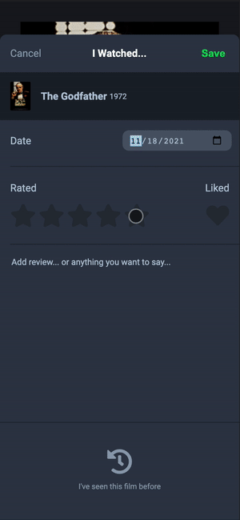

# ticket-stubs

A web application for movie lovers who want to keep track of the films they watch.

I watch a lot of movies, and it can be hard to keep track of what I watched, what were my initial thoughts of a film, when I watched it, and other miscellaneous details about each movie-watching experience. I built this project as a way to record these details and to be able to revisit them in the future.

## Technologies Used

- HTML5
- CSS3
- JavaScript

## Live Demo

Try the application live at [jamiecafirma.github.io/ticket-stubs/](jamiecafirma.github.io/ticket-stubs/)

## Features

- User can search up a movie.
- User can create a movie diary entry.
- User can view entries.
- User can edit an entry.
- User can delete an entry.

## Preview




## Future Development

- User can search for a movie diary entry.
- User can use tags to sort entries.

### Getting Started

1. Clone the repository.

    ```shell
    git clone https://github.com/jamiecafirma/ticket-stubs.git
    cd ticket stubs
    ```

2. Install all dependencies with NPM.

    ```shell
    npm install
    ```

3. You can view the application by opening index.html in your browser.
